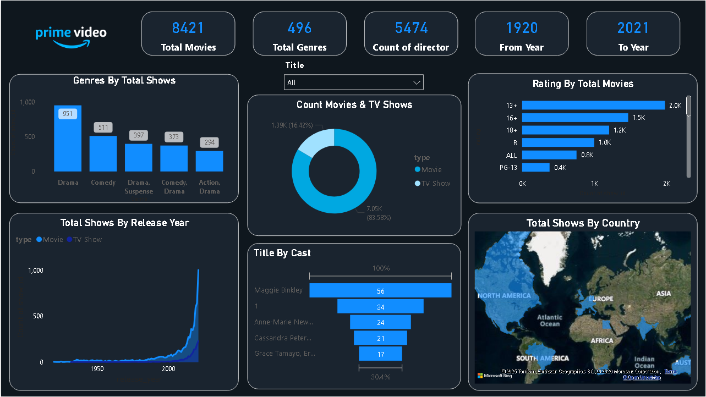

# Amazon Prime Video Content Analysis (Power BI Project)

## 📌 Project Overview
This project provides a comprehensive analysis of the Amazon Prime Video library (as of 2021). The goal was to transform raw, messy data into a strategic business dashboard that helps stakeholders understand content distribution, genre popularity, and library freshness.

## 📊 Dashboard Preview

*(Note: Replace the link above with the image you upload to GitHub)*

## 🛠️ Tech Stack & Skills
* **Data Cleaning:** Power Query (ETL)
* **Data Modeling:** Star Schema, Normalization
* **Analysis:** DAX (Data Analysis Expressions)
* **Visualization:** Power BI Desktop
* **Data Source:** Amazon Prime Dataset (9,600+ rows)

## 🚀 Key Features & Transformations
To move beyond a basic report, I implemented the following advanced features:

### 1. Advanced Data Transformation (Power Query)
* **Normalization:** The 'Cast' and 'Listed_in' columns contained multiple values in single cells. I used **Split Column by Delimiter into Rows** to enable granular analysis of individual actors and genres.
* **Data Profiling:** Handled missing values in the 'Rating' and 'Director' columns to ensure accurate reporting.

### 2. Custom DAX Measures
* **Content Age Analysis:** Created a logic to categorize content into "New Releases" (last 5 years) vs. "Classics" to analyze library freshness.
* **Dynamic Metrics:** Built measures for Total Titles, Total Ratings, and Average Release Year.
* **Highlighting Logic:** (Optional) Implemented conditional formatting to highlight top-performing categories.

### 3. UI/UX Design
* **Midnight Cinema Theme:** Designed a high-contrast dark-mode interface (`#0B0E11`) for a premium look and feel.
* **Interactive Navigation:** Added a **Search Slicer** allowing users to search by Title or Cast, and a **Reset Button** to clear all filters instantly.

## 📈 Key Insights
* **Dominant Genres:** Drama and Comedy make up the largest portion of the library.
* **Content Strategy:** Approximately X% of the library consists of Movies, while TV Shows are growing in the "New Release" category.
* **Library Maturity:** A significant portion of the catalog is rated 13+ and 16+, targeting a mature audience.

## 📂 How to Use
1. Download the `Amazon Prime dashboard.pbix` file.
2. Open it using **Power BI Desktop**.
3. Use the slicers on the left to filter by Genre, Type, or Year.
